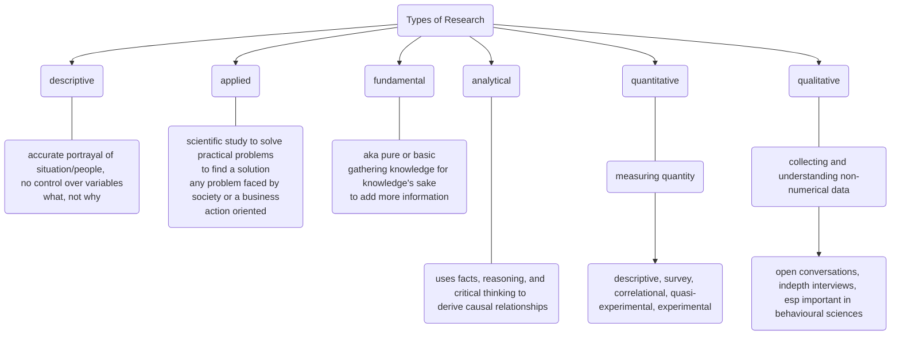

# What is research? 

- "**systemized** way to gain new information" 
- "movement from known to unknown"
- going from problem to conclusion
- search for knowledge
- using current information to add new, unique information to the body of information
- to increase stock of knowledge

According to Clifford Woody,  
defining and redefining problems, 
formulating hypothesis; 
collecting, organizing and evaluating data; 
making deductions and reaching conclusions; 
and at last carefully testing the conclusions

## Characteristics 
- is scientific
- any branch of knowledge
- rational
- based on facts, rooted in reality 

## Objectives of Research 
- discover answers using scietific procedures 
- to gain **familiarity** with a phenomenon (exploratory/formulatory)
- to **accurately represent** characteristics of an individual / group (descriptive)
- to determine frequency of a particular event (diagnostic)
- establish causal relationship (hypothesis testing)

## Motivation for research 
(this is bleh and is included only because it is part of the syllabus)
1. Discover something new
2. Portray actual characteristics of any phenomena
3. Establish causal relationship
4. Confirm existing relationships / validity of the same
5. To get a research degree and consequential benefits (really? "motivation to do it - have to do it")
6. Desire to help society 
7. Desire to gain respect

 ![[Types of Research]] 

mnemonic: DAAFQQ (pronounced dafuq) 
