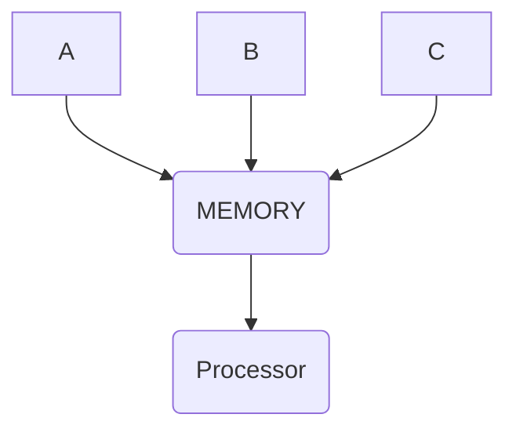

#cloud #cloudcomputing 

| parallel | distributed |
|---|---|
|single computer|multiple computers|
|many operations simultaneously|system components are located at different locations |
|multiple processors|multiple computers|
|shared or distributed memory | ONLY distributed|
|Processors communicate using bus|computer communicate w each other through message passing|
|improves sysem performance|improves scalability, fault tolerance, resource sharing|

## Serial Computing / Sequential Computing 
one task(operation/instruction) at a time, in sequence 

## Parallel Computing 
**many instructions** are carried out **simultaneously** 
depending on the theory that large problems can often be divided into smaller ones, and then solved concurrently ("in parallel")

### Why did it arise? 
- due to hitting a bottleneck in terms of frequency scaling [^1]
- higher frequency = more power draw, more heat generated 
- so instead, we have been able to reduce space needed for components and  pack more computational power in. More compute models instead of higher frequency 

### Features 
- main model in computers, as multi-core processors (multiple processing units on the same chip)
- saves time and money 
- improves performance 
- SINGLE COMPUTER
-  can use shared or distributed memory 
- COMMUNICATION VIA BUS (??check - cannot find any sources)
- Fault Tolerance (if one core fails, other is there; redundancy)

[^1]: Frequency scaling or ramping was the dominant force in  processor performance increases from the mid-1980s until roughly the end of 2004. Frequency Scaling = increasing the frequency of the processor / clock, thereby reducing runtime. 

## Distributed Computing 
a single task is divided **among multiple computers** that communicate with **each other over a network** 

### Features 
several autonomous computational entities
each with their own local memory 
communicate via message passing 

### Elements (???check)
(most of these just to be a direct paste from IBM documentation for one of their server models??)
**user interface client** 
	provides info 
	helps monitor and control the system
	not on the same system as primary controller usually

primary controller 

**secondary controller**
	communications controller 
	regulating the flow of server processing requests and managing the system’s translation load
system datastore 
	shared system datastore, either in one computer or distrubuted among many 
	each computer has local memory 
database 
	relational database 
	allows multiple users to access same info simultaneously 

### Application 
- email by ARPANET was the largest and most successful implementation of distributed computing 
- Peer-2-Peer (such as Torrents, file sharing)

[[Cloud Computing Unit 1]]

also see - [[Moore's Law]]